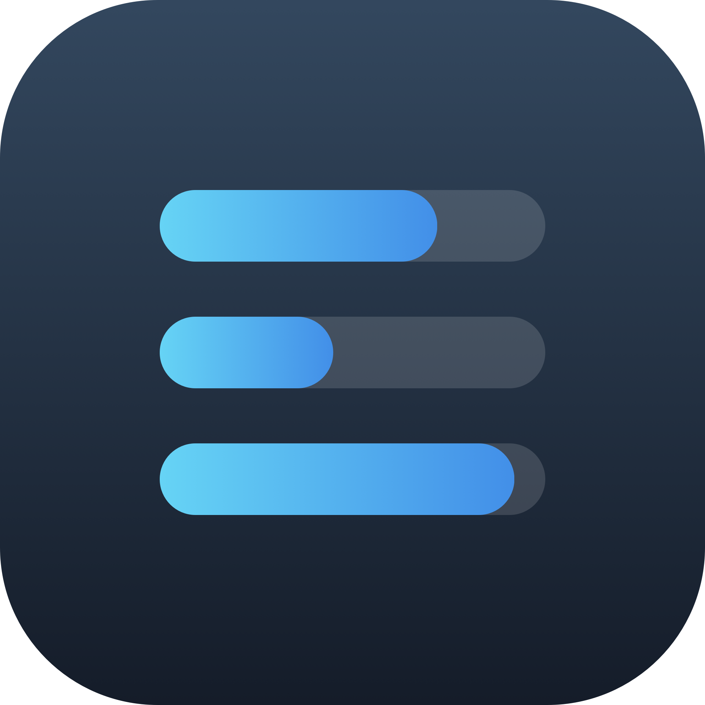
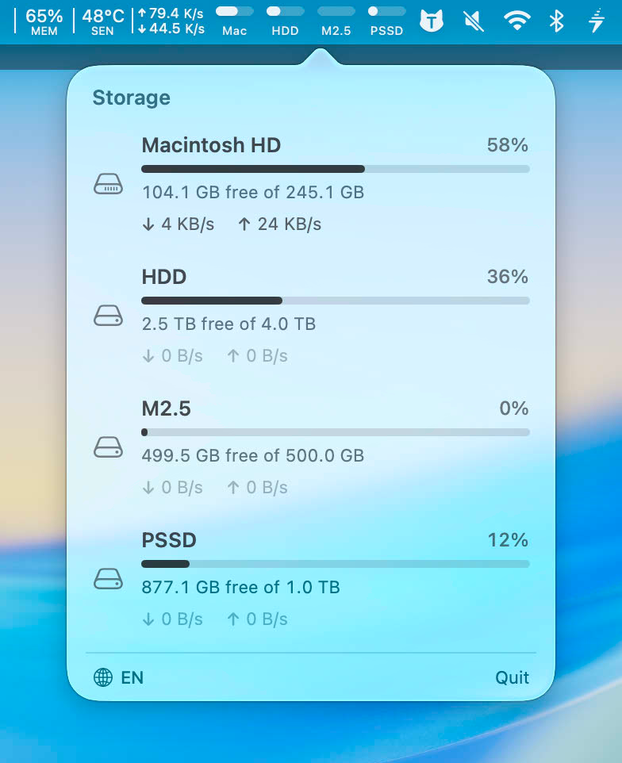

<div align="center">



# DiskBar 💽

**在 macOS 状态栏一眼看到每块硬盘的使用情况和实时读写速度**
**Every drive's usage & live read/write speed, right in your menu bar**



</div>

## 为什么做它 · Why

我把 Mac mini 当 NAS 用，外接了好几块硬盘，想随时一眼看到每块盘还剩多少、正在以多快的速度读写 —— 于是有了 DiskBar。

I use a Mac mini as a NAS with several external drives, and I just wanted to glance at how full each disk is and how fast it's reading/writing — at any moment, without opening anything. So I built DiskBar.

## 功能 · Features

- 📊 状态栏迷你进度条显示每块盘占用（最多 4 块，内置盘固定第一）
  · Mini usage bars per drive in the menu bar (up to 4, internal disk first)
- ⚡ 实时读写速度，展开详情时每秒刷新（关闭即停，不占资源）
  · Live read/write speed, refreshed every second only while the panel is open
- 🗂 点击硬盘在访达中打开（内置盘 → 下载文件夹，外接盘 → 挂载点）
  · Click a drive to reveal it in Finder
- 🌗 单色图标自适应深色 / 浅色菜单栏
  · Monochrome icon adapts to light / dark menu bar
- 🌐 中英文切换，首次跟随系统语言
  · Chinese / English, follows system language on first launch
- 🚀 开机启动 · Launch at login

## 下载 · Download

前往 [**Releases**](https://github.com/think2011/DiskBar/releases/latest) 下载最新的 `DiskBar.zip`，解压后把 `DiskBar.app` 拖进「应用程序」即可。

Grab the latest `DiskBar.zip` from [**Releases**](https://github.com/think2011/DiskBar/releases/latest), unzip, and move `DiskBar.app` into Applications.

> 首次打开若提示「来自身份不明的开发者」：在「系统设置 → 隐私与安全性」点「仍要打开」。
> First launch may warn about an unidentified developer — go to System Settings → Privacy & Security → "Open Anyway".
>
> 仅支持 Apple Silicon。Apple Silicon only.

## 构建 · Build

```bash
bash build.sh                 # 编译并输出 DiskBar.app 到桌面 / outputs to Desktop
bash build.sh /Applications   # 或直接装到「应用程序」/ or install into Applications
```

只需 Xcode Command Line Tools，无需完整 Xcode（用 `swiftc` 手搓 `.app`）。
Only needs Xcode Command Line Tools — no full Xcode (the app is assembled by `swiftc`).

## License

MIT © think2011
