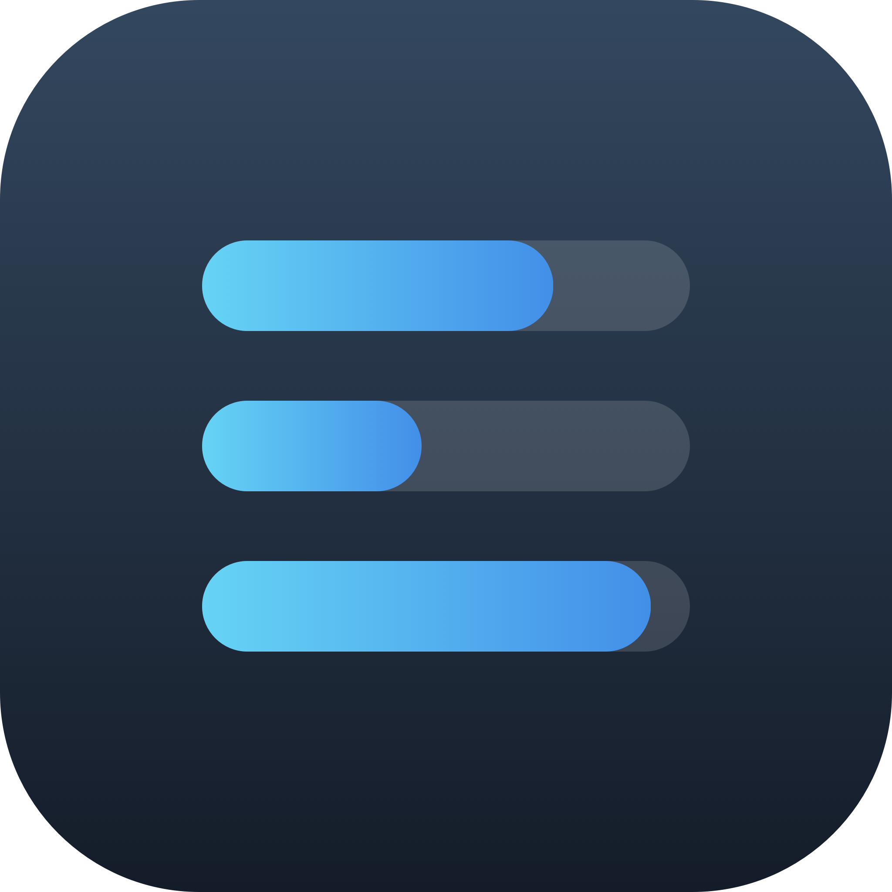
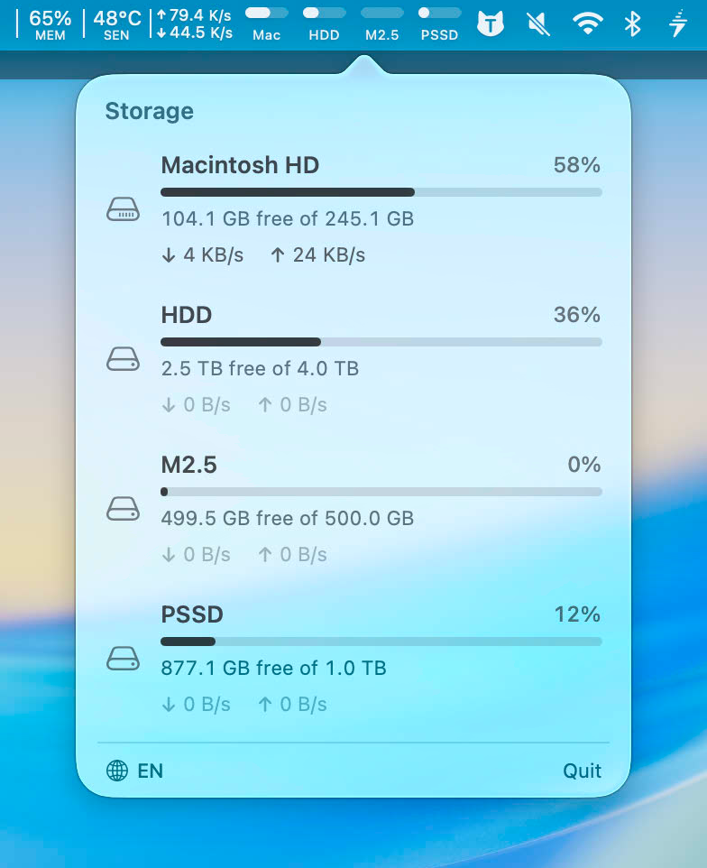

# DiskBar 💽

**在 macOS 状态栏一眼看到每块硬盘的使用情况和实时读写速度**
**Every drive's usage & live read/write speed, right in your menu bar**

  
  
  
  

## 为什么做它 · Why

我把 Mac mini 当 NAS 用，外接了好几块硬盘，想随时一眼看到每块盘还剩多少、正在以多快的速度读写 —— 于是有了 DiskBar。

I use a Mac mini as a NAS with several external drives, and I just wanted to glance at how full each disk is and how fast it's reading/writing — at any moment, without opening anything. So I built DiskBar.

## 功能 · Features

- 📊 在状态栏直接看每块盘还剩多少，最多显示 4 块盘
  · See free space for up to 4 drives directly from the menu bar
- ⚡ 显示实时读写速度，拷贝、备份、下载时不用猜
  · Live read/write speed for copies, backups, downloads, and other disk work
- 🖥️ 可选桌面小组件，想常看时就放在角落
  · Optional desktop widget for when you want the numbers always visible
- ↕️ 硬盘顺序可以自己排，桌面小组件也会跟着同步
  · Reorder drives once, and the desktop widget uses the same order
- 🗂 点击硬盘直接在访达中打开
  · Click a drive to open it in Finder
- 🌗 单色图标自适应深色 / 浅色菜单栏
  · Monochrome icon adapts to light / dark menu bar
- 🌐 中英文切换，首次跟随系统语言
  · Chinese / English, follows system language on first launch
- 🚀 开机启动 · Launch at login

## 轻量够用 · Small and practical

DiskBar 适合一直开着。它不是一个大面板，也不想把桌面变复杂；只是把我经常看的几件事放近一点：哪块盘快满了，现在有没有读写。

DiskBar is meant to be left running. It is not a dashboard, and it does not try to take over the desktop. It just keeps the disk numbers I check most often close by: what is getting full, and whether anything is reading or writing.

平时看状态栏就够了；需要多一点信息时点开详情；如果想常驻，就把桌面小组件放在顺手的位置。

Most of the time the menu bar is enough. Open the panel when you want more detail, or keep the small widget on the desktop when you want it visible all the time.

## 下载 · Download

前往 [**Releases**](https://github.com/think2011/DiskBar/releases/latest) 下载最新的 `DiskBar.zip`，解压后把 `DiskBar.app` 拖进「应用程序」即可。

Grab the latest `DiskBar.zip` from [**Releases**](https://github.com/think2011/DiskBar/releases/latest), unzip, and move `DiskBar.app` into Applications.

> 首次打开若提示「来自身份不明的开发者」：在「系统设置 → 隐私与安全性」点「仍要打开」。
> First launch may warn about an unidentified developer — go to System Settings → Privacy & Security → "Open Anyway".
>
> 仅支持 Apple Silicon。Apple Silicon only.

## License

MIT © think2011
